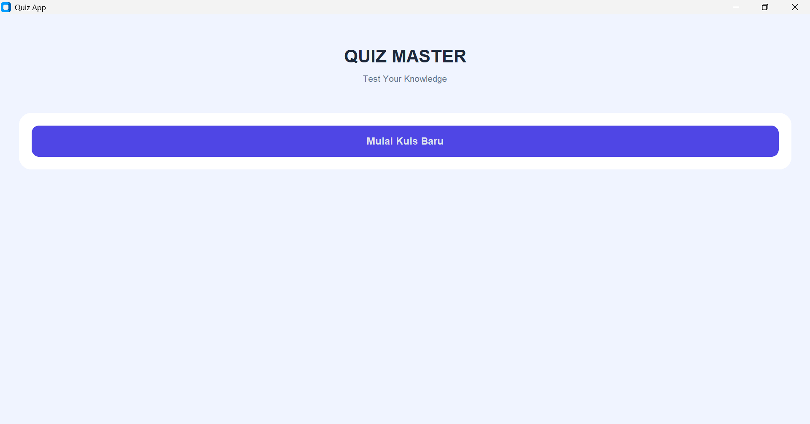
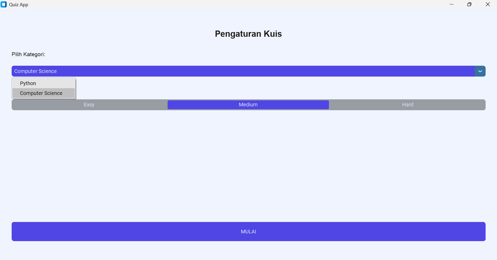
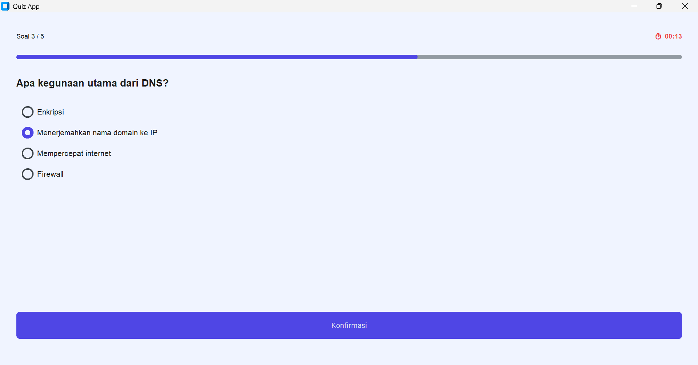
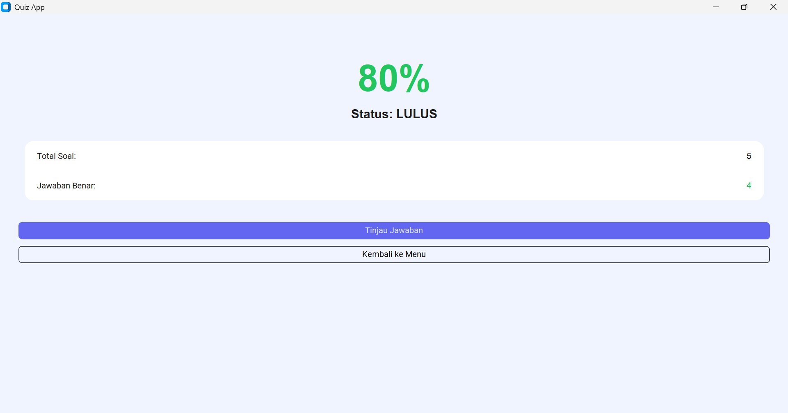
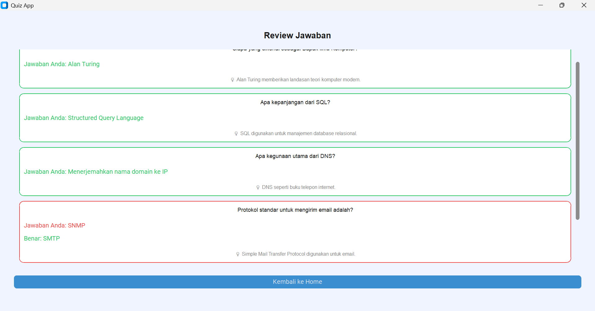

# Quiz Master Pro

**Quiz Master Pro** is a desktop-based quiz application built with **Python & CustomTkinter**,  
designed to test users’ knowledge in **Python** and **Computer Science** through a modern and interactive interface.

This project was created as a **Python GUI application**, focusing on:
- clean code
- user experience
- data persistence (JSON)
- a modular quiz system

---

## Features

- # Multiple Categories  
  - Python  
  - Computer Science  

- # Difficulty Levels  
  - Easy  
  - Medium  
  - Hard  

- # Countdown Timer per Question  
- Real-time Progress Bar  
- Visual Answer Feedback (Correct / Incorrect)  
- Answer Review with Explanations  
- Quiz History (stored locally using JSON)  
- Modern UI built with CustomTkinter  

---

## Application Preview

> *(Add screenshots inside the `screenshots/` folder)*

### Home


### Quiz Setup


### Quiz Session


### Result


### Review Answers


---

## 🗂 Project Structure

```text
quiz-app/
├── main.py
├── questions.json
├── history.json      # ignored (user-generated data)
├── screenshots/
│   ├── home.png
│   ├── setup.png
│   ├── quiz.png
│   ├── result.png
│   └── review.png
